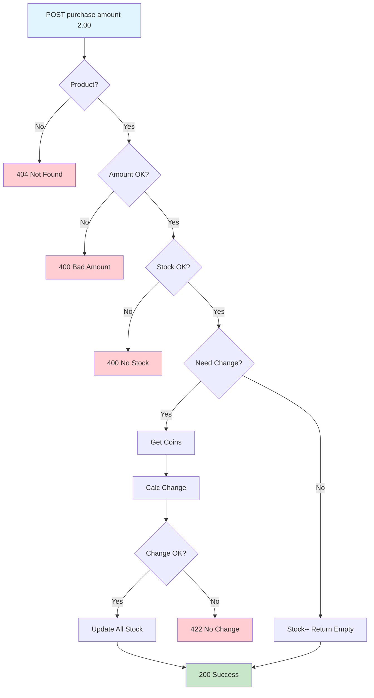

## REQUIREMENTS

1. Get all products available and out of stock with corresponding prices
2. Fetch one product with all information on it
3. Select a product and insert X amount
    - Ask for more money if not enough
    - Return change if too much is provided
    - Accept coins in denominations 1p, 2p, 5p, 10p, 20p, 50p, £1, £2 and accumulate the inserted amount then return product with/o change
4. Ability to refill products in the machine
5. Ability to refill the change in the machine
6. Ability to edit a product
7. Ability to add a new product
8. Ability to delete a product

### Validations
    When a product is fetched or selected with X amount, these validations must be done:

    - Check if the product selected is valid (exists in DB?)
    - If there is enough product stock
    - When trying to return change if there isn’t enough change available in the machine, deny buy and return coins

### API sketch

- 1)GET /products  —> products#index
- 2)GET /products/:id  —> products#show
- 6)PUT /products/:id  —> products#update
- 7)POST /products  —> products#create
- 8)DELETE /products/:id —> products#destroy

Resources :products except: %i[new edit] 

- 3)POST /products/:id/purchase —> products#purchase
- 4)POST /products/refill —> products#refill
- 5)POST /coins/refill —> coins#refill  

## Assumptions

- It was assumed that the machine or the Frontend system that calls this API is responsible to validate the coins, like if they are real or in the right format, the API will only process the purchase flow and give back change if needed.
- For simplicity it is assumed that the system should only manage 1 vending machine and not multiple.
- The currency is assumed to be handled by frontend.
- Since it should be first used as an internal tool, no auth (like JWT) has been provided just yet. This should be a further improvement if to be used by multiple machines and/or services.


## 🗄️ Database Schema

```
coins
├── denomination (unique, int)  → 200,100,50,20,10,5,2,1
├── stock (int ≥ 0)            → Current coin inventory
└── timestamps

products  
├── name (string 200, unique)  → "Coke", "Water"
├── stock (int ≥ 0)            → Current product inventory  
├── price (decimal 10,2 ≥ 0)   → 1.50, 2.99
└── timestamps
```

## 🧩 Purchase Flow


